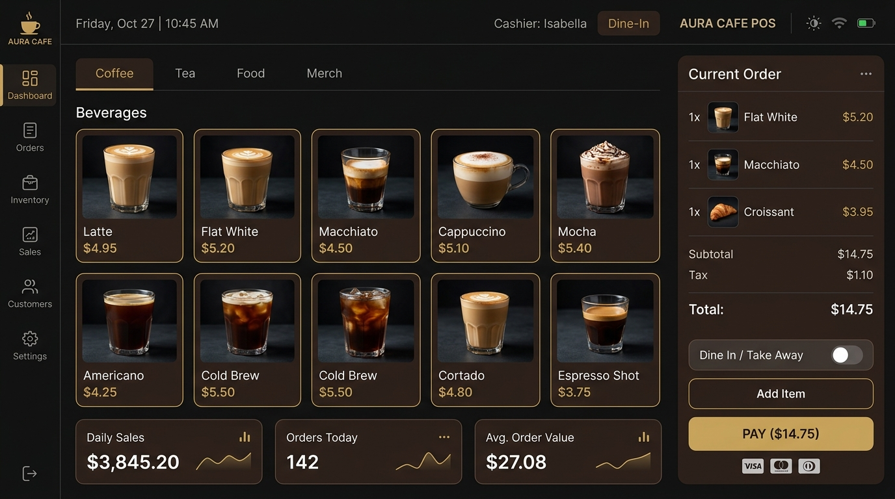
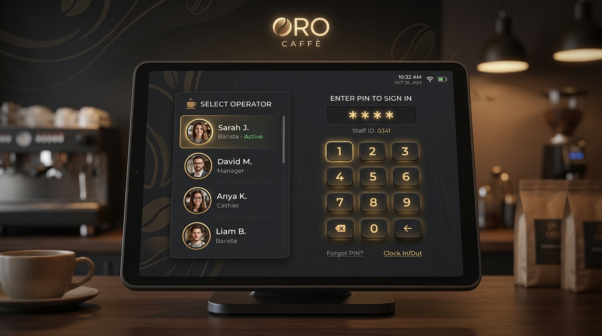

# BrewOS Coffee Shop Management System - POS Terminal

A modern, dark-themed, and responsive Coffee Shop Point of Sale (POS) terminal built with vanilla HTML, CSS, and JavaScript. Styled in a premium dark-espresso color palette with caramel-gold gradients and subtle hover micro-animations, this terminal provides a full suite of features for cashier operations, menu exploration, order history, customer feedback, and customizable operator preferences.

## 📸 Interface Preview

*Figure 1: Premium Cashier Dashboard view featuring active product catalog, category tabs, and real-time checkout cart panel.*

*Figure 2: Operator Login and PIN pad screen design with active operators list.*

---

## 📁 Project Architecture & Components

Below is the directory structure and a list of key files with clickable links:

### HTML Views (UI Screens)
*   **[index.html](file:///D:/MAIN%20PROJECT/index.html)**: The landing screen representing the operator sign-in page. It features an interactive operator selection dropdown, a tactile PIN pad, and a session-sync loader overlay.
*   **[dashboard.html](file:///D:/MAIN%20PROJECT/dashboard.html)**: The main POS terminal view. This dashboard displays the product grid catalog, horizontal category tabs, today's metrics, and the real-time order cart.
*   **[history.html](file:///D:/MAIN%20PROJECT/history.html)**: Persistent order history view for completed and held transactions.
*   **[menu.html](file:///D:/MAIN%20PROJECT/menu.html)**: The digital menu board catalog page. It allows cashiers or customers to explore recipes, review detailed ingredient lists, view calories/sugar specs, check stock counts, and filter by dietary tabs (Veg, Vegan, Dairy-Free).
*   **[feedback.html](file:///D:/MAIN%20PROJECT/feedback.html)**: Customer and staff experience rating page featuring interactive star ratings, categories, recent reviews, and live review metrics.
*   **[settings.html](file:///D:/MAIN%20PROJECT/settings.html)**: Operator preferences and profile page containing display customization, visual alerts, and quick checkout settings.

### JavaScript Logic (Behavioral Layer)
*   **[script.js](file:///D:/MAIN%20PROJECT/script.js)**: Holds the sign-in business logic. Evaluates operator PIN codes and uses `sessionStorage` to carry session credentials onto the dashboard.
*   **[dashboard.js](file:///D:/MAIN%20PROJECT/dashboard.js)**: Directs POS business logic on the main screen, including live search filtering, catalog management, real-time cart calculations (discounting, tax, totals), held orders, checkout modals, and session logout redirection.
*   **[history.js](file:///D:/MAIN%20PROJECT/history.js)**: Renders stored orders from `localStorage`, including paid and held statuses, totals, and search/filter controls.
*   **[menu.js](file:///D:/MAIN%20PROJECT/menu.js)**: Manages catalog state, live search, and categorized views on the menu catalog page.
*   **[feedback.js](file:///D:/MAIN%20PROJECT/feedback.js)**: Manages submission validation, storage, and statistics computation for feedback reviews.
*   **[settings.js](file:///D:/MAIN%20PROJECT/settings.js)**: Applies dynamic settings (e.g. font adjustments), validates profile changes, and syncs settings to `localStorage` per operator.
*   **[bg-circles.js](file:///D:/MAIN%20PROJECT/bg-circles.js)**: Controls the fluid ambient glowing circles animations in the background across different pages.

### Design Systems & Project Plans
*   **[style.css](file:///D:/MAIN%20PROJECT/style.css)**: A unified styling system styled in a premium dark-espresso color palette with caramel-gold gradients and subtle hover micro-animations. It implements responsive grids and flex layouts for desktops, tablets, and mobile devices.
*   **[reqements.md](file:///D:/MAIN%20PROJECT/reqements.md)**: Product requirements plan outlining scope, stakeholders (Admin, Employee, Customer), core functional requirements, and upcoming smart AI features.
*   **[db.md](file:///D:/MAIN%20PROJECT/db.md)**: Conceptual database schema planning document mapping out relational tables like users, categories, products, inventory, orders, feedback, and AI insights.
*   **[feedback.md](file:///D:/MAIN%20PROJECT/feedback.md)**: Design notes and execution strategy for the feedback submission system.
*   **[settings.md](file:///D:/MAIN%20PROJECT/settings.md)**: Functional breakdown and implementation phases for the barista settings page.

---

## ☕ Operator Passcodes

To simulate shifts, select an active operator on the sign-in screen and enter the corresponding 4-digit passcode:

| Operator Name | Shift Role | Passcode |
| :--- | :--- | :--- |
| **Sarah Jenkins** | Senior Barista | `1234` |
| **Marcus Thorne** | Shift Supervisor | `5678` |
| **Elena Rostova** | Barista | `1111` |
| **Devon Miller** | Trainee | `0000` |

---

## 🚀 Key POS Features

1.  **Operator Shifts & Sessions**: Cashier details are carried dynamically onto the dashboard header, synchronizing session date/times using `sessionStorage`.
2.  **Live Catalog Search & Categories**: Horizontal category tabs filter products by category. The top bar search input filters the grid catalog dynamically.
3.  **Item Favoriting**: Cashiers can toggle favorite icons on any product card, updating operator preferences dynamically.
4.  **Automatic Pricing Cart**: Adds items to the current order cart, computes subtotals, applies a 5% discount for orders above ₹300, adds 5% tax, and calculates grand totals in real-time.
5.  **Checkout & Receipts**: Clicking "Proceed to Payment" populates a detailed printable receipt modal before clearing the current order.
6.  **Hold Transactions**: Places a transaction on hold and prints a generated hold reference ID.
7.  **Order History**: Completed and held orders are saved locally in `localStorage` and can be reviewed later from the sidebar.
8.  **Customer Feedback**: Enables customers or staff to submit ratings and comments. Includes average calculations and lists recent reviews in real-time.
9.  **Barista Settings**: Allows supervisors and baristas to personalize their interface (theme toggles, font resizing, and toast alerts) dynamically per session.

